# 银行业务管理系统-系统设计与实现报告

***

姓名: 梁峻滔

学号: PB19051175

中国科学技术大学 计算机科学与技术学院

2022年6月6日

***

[toc]

## 1. 概述

本项目使用 [Django](https://www.djangoproject.com/) 和 mysql 实现了一个简易的银行业务管理系统.

### 1.1 系统目标

某银行准备开发一个银行业务管理系统，要求实现**客户管理**、**账户管理**、**贷款管理**与**业务统计**四大类功能.

### 1.2 需求说明

#### 1.2.1 数据需求

银行有多个支行。各个支行位于某个城市，每个支行有唯一的名字。银行要监控每个支行的资产。 银行的客户通过其身份证号来标识。银行存储每个客户的姓名、联系电话以及家庭住址。为了安全起见，银行还要求客户提供一位联系人的信息，包括联系人姓名、手机号、Email 以及与客户的关系。客户可以有帐户，并且可以贷款。客户可能和某个银行员工发生联系，该员工是此客户的贷款负责人或银行帐户负责人。银行员工也通过身份证号来标识。员工分为部门经理和普通员工，每个部门经理都负责领导其所在部门的员工，并且每个员工只允许在一个部门内工作。每个支行的管理机构存储每个员工的姓名、电话号码、家庭地址、所在的部门号、部门名称、部门类型及部门经理的身份证号。银行还需知道每个员工开始工作的日期，由此日期可以推知员工的雇佣期。银行提供两类帐户：储蓄帐户和支票帐户。帐户可以由多个客户所共有，一个客户也可开设多个账户，但在一个支行内最多只能开设一个储蓄账户和一个支票账户。每个帐户被赋以唯一的帐户号。银行记录每个帐户的余额、开户日期、开户的支行名以及每个帐户所有者访问该帐户的最近日期。另外，每个储蓄帐户有利率和货币类型，且每个支票帐户有透支额。每笔贷款由某个分支机构发放，能被一个或多个客户所共有。每笔贷款用唯一的贷款号标识。银行需要知道每笔贷款所贷金额以及逐次支付的情况（银行将贷款分几次付给客户）。虽然贷款号不能唯一标识银行所有为贷款所付的款项，但可以唯一标识为某贷款所付的款项。对每次的付款需要记录日期和金额。

#### 1.2.2 功能需求

- **客户管理**：提供客户所有信息的增、删、改、查功能；如果客户存在着关联账户或者贷款记录，则不允许删除；
- **账户管理**：提供账户开户、销户、修改、查询功能，包括储蓄账户和支票账户；账户号不允许修改；
- **贷款管理**：提供贷款信息的增、删、查功能，提供贷款发放功能；贷款信息一旦添加成功后不允许修改；要求能查询每笔贷款的当前状态（未开始发放、发放中、已全部发放）；处于发放中状态的贷款记录不允许删除；
- **业务统计**：按业务分类（储蓄、贷款）和时间（月、季、年）统计各个支行的业务总金额和用户数，要求对统计结果同时提供表格和曲线图两种可视化展示方式.

#### 1.2.3 需求说明

1. 支行、部门和员工的信息需要预先插入到数据库中，本项目假设这三类数据已经在数据库中了，并且本实验不要求实现这三类数据的维护。
2. 后台 DBMS 使用 MySQL；
3. 前端开发工具不限，可以是 C/S 架构也可以是 B/S 架构；
4. 查询功能允许自行设计，但要求尽可能灵活设计，考虑用户多样化的查询需求；
5. 各类数据的类型可自行根据实际情况设计；
6. 测试数据自行设计；
7. 系统实现时要保证数据之间的一致性；
8. 程序须有一定的出错处理，要求自己先做好测试，能够处理可以预见的一些错误，例如输入的客户姓名带单引号（类似 `O'Neil`）、输入数据不合法等等；
9. 其余功能可以自行添加，例如登录管理、权限管理等等，但不做强制要求。如果做了添加，请在实验报告中加以描述；
10. 本实验要求单独完成。

### 1.3 本报告的主要贡献

- 本报告的主要贡献在于完整、详实、丰富地填满了这份繁杂冗长的实验报告模板，尽自己所能**充实**了各位助教阅读实验报告的体验.
- 其次，本报告介绍了一个达到 1.1 节所述目标、完成 1.2 节所述需求的 B/S 架构的银行业务管理系统，并对其代码及实现技巧进行了解析.
- 最后，本报告在第 5 章为实验及实验报告的设计提出了一些改进意见.

## 2. 总体设计

系统采用 [Django](https://www.djangoproject.com/) 框架, 使用 Model-Template-View 架构进行前后端一体的全栈开发, 前端采用 [Layui](https://www.layuiweb.com/) 进行页面的简单优化, 由于本人时间和水平有限, 没有实现前端的动态交互功能, 仅可以通过静态页面进行相关操作.

### 2.1 系统模块结构

系统采用 Django 独有的 MTV 模式, 其结构如下图所示:

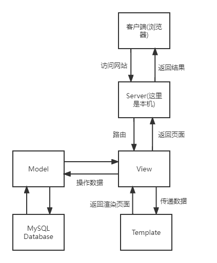

各模块功能:

* Server(本机上的一个进程)负责处理客户端(浏览器)发过来的 HTTP 请求, 解析内容, 根据配置好的路由规则选择匹配的视图函数进行处理, 然后向客户端返回 HTTP 响应.
* View(各个视图函数)负责执行实际的业务逻辑, 包括调用模型类接口对数据进行操作, 数值计算, 调用相应的模板等.
* Model(各个模型类)为 ORM, 负责定义数据库结构(各个关系模式, 即各个表)以及与数据库通信, View所进行的数据库操作都是经过 Model 层来与数据库交互.
* Template(各个模板)负责接收 View 层传来的数据, 对模板进行渲染, 然后交由 View 返回给 Server, 然后返回给客户端.
* MySQL为后端 DBMS, 负责数据的存储和维护等.

### 2.2 系统工作流程

系统工作流程如 2.1 节图所示, 解说如下:

1. 浏览器向服务器发送 HTTP 请求(GET/POST);
2. 服务器(本机上的一个server进程)接收请求后, 根据定义好的路由(routes)调用合适的视图函数处理;
3. 视图函数接收到请求, 处理请求参数, 根据请求内容调用 Model 的 ORM 接口对数据库进行增删改查操作;
4. Model层调用 ORM 操作, 构造 SQL 语句, 与 DBMS 服务器进行交互, 将结果转换成 Django 模型类对象, 返回给调用者;
5. 视图函数做完数据库操作后, 将必要的数据结果传递给 Template 层, Template 层在指定的 HTML 模板上使用数据渲染页面, 将页面返回给视图函数;
6. 视图函数将最后的 HTML 页面传回给前端服务器, 前端服务器将 HTML 页面作为 web 响应发送给浏览器.

### 2.3 数据库设计

下图是 Lab2 设计的数据库模型 ER 图, 系统实现的数据库模型基本与之一致,  但略有改动:

* 删除了一些不必要的属性: 例如负责人的业务号;
* 由于 Django 模型类接口的特性, **负责人**这一关系所代表的模型可以在**客户**模型类中添加一个==ForeignKeyField==来实现, 不需要另外自己创建一个模型类(对应数据库中的一张表), 虽然底层可能还是会有类似的关系表被创建出来, 但这一过程对开发者不可见, 开发者不必直接使用SQL语句.
* 删除了**办理业务**这一模式, 因为账户与客户, 账户与支行, 贷款与客户, 贷款与支行的关系等都可以使用 Django 提供的 ==ForeignKey== 和 ==ManyToManyField== 来方便的实现, 其中==ForeignKey==处理的是多对一关系.

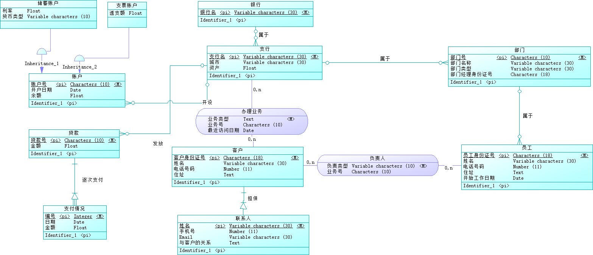

以下为最终实现时的 Django 模型类, 一个模型类定义数据库中的一个关系模式(一张表).

#### 2.3.1 支行

```python
class Branch(models.Model):
    name = models.CharField('支行名', primary_key=True, max_length=64, default='')
    city = models.CharField('所在城市', max_length=64, default='')
    assets = models.DecimalField('资产', max_digits=14, decimal_places=2, default=0.0)
    created_time = models.DateTimeField('创建时间', auto_now_add=True)
    updated_time = models.DateTimeField('更新时间', auto_now=True)
```

主要属性:

* 名称, 为主键
* 所在城市
* 资产

资产属于金钱, 使用 Django 推荐的两位定点小数`DecimalField`存储, 下面所有的属于 [金钱] 的属性都使用==DecimalField==.

#### 2.3.2 部门

```python
class Department(models.Model):
    no = models.CharField('部门号', max_length=10, primary_key=True, default='')
    name = models.CharField('部门名称', max_length=64, default='')
    type = models.CharField('部门类型', max_length=64, default='')
    manager_id = models.CharField('经理身份证号', max_length=18, default='')
    created_time = models.DateTimeField('创建时间', auto_now_add=True,)
    updated_time = models.DateTimeField('更新时间', auto_now=True)
```

主要属性:

* 部门号, 为主键
* 部门名称
* 部门类型
* 经理身份证号

#### 2.3.3 员工

```python
class Staff(models.Model):
    id = models.CharField('员工身份证号', max_length=18, default='', primary_key=True)
    name = models.CharField('姓名', max_length=64, default='')
    phone = models.CharField('电话号码', max_length=11, default='')
    address = models.CharField('住址', max_length=256, default='')
    start_date = models.DateField('开始工作日期', default='2022-5-16')
    department = models.ForeignKey(Department, on_delete=models.CASCADE, verbose_name="所属部门")
```

主要属性为:

* 身份证号, 为主键
* 姓名
* 电话号码
* 住址
* 开始工作日期
* 所属部门(使用==ForeignKey==指向一个Department对象, 一个部门有多个员工, 但一个员工只能对应一个部门)

#### 2.3.4 客户

```python
class Customer(models.Model):
    id = models.CharField('客户身份证号', max_length=18, default='', primary_key=True)
    name = models.CharField('姓名', max_length=64, default='')
    phone = models.CharField('电话号码', max_length=11, default='')
    address = models.CharField('住址', max_length=256, default='')
    
    # 有一个员工作为负责人, 有负责类型: 账户/贷款/两者皆是
    # 定义一个表负责类型的枚举类
    class PrincipalType(models.IntegerChoices):
        ACCOUNT = 0
        LOAN = 1
        BOTH = 2
    principal = models.ForeignKey(Staff, on_delete=models.PROTECT, verbose_name="负责人") # 客户的负责人, 客户存在时不允许删除负责人
    principal_type = models.IntegerField(choices=PrincipalType.choices, verbose_name="负责类型", default=PrincipalType.ACCOUNT)
```

主要属性:

* 身份证号, 为主键
* 姓名
* 电话号码
* 住址
* 负责人(使用==ForeignKey==指向一位员工, 一位员工可以负责多位客户, 但一位客户只有一位负责人)
* 负责人类型(账户/贷款/两者皆是)

每位客户还有一位联系人, 联系人是客户的弱实体, 使用一个单独的模型类表示联系人, 联系人模型类中有一个==OneToOneField==指向其从属的客户.

每位客户还有一个或多个账户, 且一个账户可以为多个客户所共有, 因此客户和账户是多对多的关系, 后面在**账户**模型类中使用==ManyToManyField==存储关联客户.

#### 2.3.5 客户的联系人

```python
class Contact(models.Model):
    customer = models.OneToOneField(Customer, on_delete=models.CASCADE, primary_key=True) # 与客户是一对一的关系, 一个客户决定一个联系人
    name = models.CharField('姓名', max_length=64, default='')
    phone = models.CharField('电话号码', max_length=11, default='')
    email = models.EmailField('邮箱地址', blank=True)
    relationship = models.CharField('与客户的关系', max_length=256, default='')
    created_time = models.DateTimeField('创建时间', auto_now_add=True)
    updated_time = models.DateTimeField('更新时间', auto_now=True)
```

主要属性为:

* 关联的客户, 使用`OneToOneField`, 为主键, 使用级联删除(on_delete=models.CASCADE), 表示当客户存在时, 不允许删除联系人, 但删除客户时会将对应的联系人也删除
* 姓名
* 电话号码
* Email
* 与客户的关系

#### 2.3.6 账户

```python
class Account(models.Model):
    class Meta: # Account类作为抽象类使用, 该模型不会创建数据表
        abstract = True
    no = models.CharField('账户号', max_length=10, default='', primary_key=True)
    class AccountType(models.IntegerChoices):
        DEPOSIT = 0
        CHEQUE = 1
    account_type = models.IntegerField("账户类型", choices=AccountType.choices, default=AccountType.DEPOSIT)
    open_date = models.DateField('开户日期', auto_now_add=True)
    balance = models.DecimalField('余额', max_digits=14, decimal_places=2, default=0.0)
    branch = models.ForeignKey(Branch, on_delete=models.PROTECT, verbose_name="开户支行") # 账户存在时不允许删除支行
    customers = models.ManyToManyField(Customer, verbose_name="关联客户")
    created_time = models.DateTimeField('创建时间', auto_now_add=True)
    updated_time = models.DateTimeField('更新时间', auto_now=True)
```

主要属性:

* 账户号, 为主键
* 账户类型(储蓄/支票)
* 余额
* 开户日期
* 开户支行(使用==ForeignKey==指向一个Branch对象)
* 关联客户(可能存在多个关联客户, 使用==ManyToManyField==)

该**账户**模型类是一个抽象类, 不会在数据库中创建一张表, 它主要用于让后面的**储蓄账户**模型类和**支票账户**模型类继承, **账户**模型类中的属性是共有属性. 结合**开户支行**和**关联客户**两个属性就可以实现"一个客户在一个支行只能开设每种类型的账户各一个"的约束: 在为某个账户添加关联客户时, 检查要添加的该客户是否已经在同一个支行开设过同一种账户(==ManyToManyField==支持反向查询).

#### 2.3.7 储蓄账户

```python
class Deposit(Account):
    interest_rate = models.FloatField('利率', default=1.0) # 使用float类型
    currency_type = models.CharField('货币类型', max_length=3, default='') # 货币类型为3个大写字母
```

继承==Account==模型类, 增添表示**利率**和**货币类型**的字段.

#### 2.3.8 支票账户

```python
class Cheque(Account):
    overdraft = models.DecimalField('透支额', max_digits=14, decimal_places=2, default=0.0)
```

继承==Account==模型类, 增添表示**透支额**的字段.

#### 2.3.9 贷款

```python
class Loan(models.Model):
    no = models.CharField('贷款号', max_length=10, default='', primary_key=True)
    amount = models.DecimalField('总金额', max_digits=14, decimal_places=2, default=0.0)
    branch = models.ForeignKey(Branch, on_delete=models.PROTECT, verbose_name="贷款支行")
    customers = models.ManyToManyField(Customer, verbose_name="关联客户")
    status = models.CharField('贷款状态', max_length=64, default='未开始发放')
    created_time = models.DateTimeField('创建时间', auto_now_add=True)
    updated_time = models.DateTimeField('更新时间', auto_now=True)
```

主要属性:

* 贷款号, 为主键
* 总金额
* 贷款支行
* 关联客户
* 贷款状态

其中贷款状态根据相关联的贷款发放记录(Payout)来计算, 这里没有显示表示出与贷款相关联的贷款发放记录, 这是因为在后面的==Payout==模型类中使用了==ForeignKey==指向贷款对象, 而 Django 的 ORM 支持反向查询.

#### 2.3.10 贷款发放记录

```python
class Payout(models.Model):
    no = models.CharField('payout编号', max_length=10, default='')
    date = models.DateField('支付日期', default='2022-5-16')
    amount = models.DecimalField('金额', max_digits=14, decimal_places=2, default=0.0)
    loan = models.ForeignKey(Loan, on_delete=models.CASCADE, verbose_name="所属贷款")
    created_time = models.DateTimeField('创建时间', auto_now_add=True)
    updated_time = models.DateTimeField('更新时间', auto_now=True)
    class Meta:
        unique_together = ('no', 'loan')
```

主要属性:

* 编号, 每笔贷款都有顺序编号1, 2, 3, ...的发放记录
* 发放日期
* 发放金额
* 关联贷款

其中关联贷款和编号共同确定一次发放记录.

#### 2.3.11 储蓄账户访问记录

```python
class Deposit_Access(models.Model):
    customer = models.ForeignKey(Customer, on_delete=models.CASCADE)
    deposit = models.ForeignKey(Deposit, on_delete=models.CASCADE)
    last_access_date = models.DateTimeField("最近访问时间", auto_now=True)
    created_time = models.DateTimeField('创建时间', auto_now_add=True)
    updated_time = models.DateTimeField('更新时间', auto_now=True)
```

主要属性:

* 关联客户
* 关联储蓄账户
* 最近访问日期

该模型类的作用是根据(客户, 储蓄账户)确定该客户对该储蓄账户的最近访问日期.

#### 2.3.12 支票账户访问记录

主要属性:

* 关联客户
* 关联支票账户
* 最近访问日期

该模型类的作用是根据(客户, 支票账户)确定该客户对该支票账户的最近访问日期.

## 3. 详细设计

项目目录结构:

```bash
. # 项目根目录
├── BankSystem # 应用目录
│   ├── __init__.py
│   ├── __pycache__
│   ├── admin.py
│   ├── apps.py
│   ├── migrations
│   ├── models.py # 定义模型类
│   ├── static    # css等静态文件
│   ├── templates # 模板
│   ├── tests.py
│   ├── urls.py   # 配置应用内路由
│   └── views.py  # View层的各个视图函数
├── dblab3
│   ├── __init__.py
│   ├── __pycache__
│   ├── asgi.py
│   ├── settings.py # 项目整体配置
│   ├── urls.py
│   ├── views.py
│   └── wsgi.py
└── manage.py # 执行项目操作
```

### 3.1 基础配置

#### 3.1.1 项目总体配置

主要是使用 Django 创建项目, 在==settings.py==中配置好使用的DBMS(这里就是MySQL), 创建数据库, 连接数据库, 创建应用(BankSystem)等. 

#### 3.1.2 应用内路由配置

在创建的BankSystem应用内建立路由-视图函数的一一映射, 即设定好什么样的请求(路由反映了请求内容)交给什么视图函数(应用内的View层)处理. 具体就是编写==./BankSystem/urls.py==. 例如查看统计数据的路由如下:

```python
urlpatterns = [
    ...,
    
    # statistics-related
    path('stats_home/', views.stats_home),
    path('stats_loan', views.stats_loan),
    path('stats_loan_year', views.stats_loan_year),
    path('stats_deposit', views.stats_deposit),
    path('stats_deposit_year', views.stats_deposit_year),
    
    ...
]
```

### 3.2 Model层

Model层的任务就是在==./BankSystem/models.py==写好上述模型类, 通过

```bash
dblab3$ python manage.py makemigrations
dblab3$ python manage.py migrate
```

在数据库中创建好各张表. 后面就是由 View 层的各个视图函数调用 ORM 接口对数据库进行增删改查操作.

### 3.3 View层

#### 3.3.1 支行管理模块

主要包含对支行简单的增删改查:

* create\_branch: 返回一个页面让客户端填写创建一个支行所需要的信息, 接收POST表单, 根据表单中的数据创建一个新的支行.
* delete\_branch: 获取 url 查询字符串中的支行名, 删除指定的支行.
* update\_branch: 返回一个页面让客户端填写可修改的项, 接收POST表单, 根据表单中的数据修改一个支行的相关信息. 要修改的支行名通过 url 查询字符串获取.

* show\_all\_branches: 获取所有支行, 返回一个用表格展示各支行的支行名, 所在城市和资产信息的页面.

#### 3.3.2 客户管理模块

首先是对客户的增删改查:

* create\_customer: 返回一个页面让客户端填写创建一个客户所需要的信息: 客户身份证号等基本信息、负责人身份证号、负责人类型、联系人的基本信息等. 根据POST表单的数据创建一个新的客户==和其联系人==.
* delete\_customer: 通过 url 查询字符串获取要删除的客户身份证号, 查询指定的客户, ==检查该客户是否存在关联账户(包括储蓄账户和支票账户)和关联贷款, 若存在至少一种都不允许删除==, 否则删除该客户.
* update\_customer: 通过 url 查询字符串获取要修改的客户的身份证号, 返回一个页面让客户端填写要修改的信息, 接收POST表单, 然后修改客户信息.
* show\_all\_customers: 获取所有客户, 返回一个用表格展示各客户的基本信息的页面. 其中包含可以查看具体某一客户更多相关信息(关联账户, 关联贷款, 联系人信息等)的入口.

然后是查看某一客户的具体信息:

* show\_customer\_principal: url 查询字符串指定客户身份证号, 返回包含该客户负责人信息的页面.

* show\_contact: url 查询字符串指定客户身份证号, 返回包含该客户联系人信息的页面.
* show\_customer_accounts: url 查询字符串指定客户身份证号, 返回包含该客户所有关联账号(储蓄和支票)信息的页面.
* show\_customer\_loans: url 查询字符串指定客户身份证号, 返回包含该客户所有关联贷款信息的页面.

#### 3.3.3 账户管理模块

首先是账户的增删改查:

* create\_account: 通过客户端表单输入开户支行、开户日期、账户类型、余额等信息, 储蓄账号需要输入利率和货币类型, 支票账号需要输入透支额, 根据账户类型随机生成一个账户号, 创建一个新的对应类型的账户. 

    需要注意的是, 一个账户可以为多位客户所共有, 一开始的思路是在创建账户时就指定所有的客户. 但是由于本人目前水平和时间有限, 没有时间和精力研究 js 等动态交互手段, 而账户关联的客户数是动态的, 所以考虑先创建一个还没有关联任何客户的账号, 然后后续添加与之关联的客户. 后面的==add\_account\_customer==介绍.

* delete\_account: 由于账户分储蓄账户和支票账户, 在数据库中实际上是分两张表存, 所以需要从 url 查询字符串中获取账户号和账户类型, 然后到对应类型账户的表中将指定账号删除.

* update\_account: 从 url 中获取账户号和账户类型, 返回一个页面指示可修改的项和这些项现在的值, 从POST表单获取修改后的值, 然后操作数据库修改.

* show\_all\_accounts: 获取所有账户, 返回一个用表格展示各账户的基本信息的页面. 其中包含可以查看具体某一账户更多相关信息(如其关联的所有客户)的入口.

然后是对某一账户的进一步操作:

* add\_account\_customer: 首先返回一个包含账户信息的页面, 让客户端填写要添加的关联客户的身份证号. 然后从POST表单获取客户身份证号, ==查询该客户是否已经在同一支行开设过相同类型的账户, 若有则不允许添加该客户(表示不允许该客户在同一支行开始两个同一类型的账户)==. 否则将该客户添加到该账户的关联客户中.
* show\_deposit\_customers: 查询指定储蓄账户的所有关联客户.
* show\_cheque\_customers: 查询指定支票账户的所有关联客户.

#### 3.3.4 贷款管理模块

首先是贷款的增删改查:

* create\_loan: 客户端通过POST表单输入创建一笔贷款所需的信息: 贷款支行和贷款总金额, 随机生成一个贷款号, 然后创建一笔新的贷款, 贷款创建时默认状态为"未开始发放". 与创建账户时类似, 由于一笔贷款可能存在多个关联客户, ==在创建贷款时不指定关联客户, 而是通过另一视图函数逐个添加==.
* delete\_loan: 根据指定贷款号删除一笔贷款, ==删除前检查贷款状态, 如果贷款状态处于"发放中"则不允许删除==.
* 实验要求贷款创建后就不允许修改.
* show\_all\_loans: 获取所有贷款, 根据各笔贷款发放记录更新贷款状态, 返回一个用表格展示各笔贷款的基本信息的页面. 其中包含可以查看具体某一笔贷款更多相关信息(如属于该笔贷款的发放记录)的入口.

然后是对某一笔贷款进一步的操作:

* add\_loan\_customer: 与上面提到的账户的操作类似, 为一笔贷款添加一个关联客户.
* show\_loan\_customers: 展示指定带看的所有关联客户.
* create\_payout: 为指定的贷款添加一条发放记录, ==添加前查询该笔贷款已发放的金额, 检查添加后总金额是否会超过贷款总金额==, 若是则不允许添加. 否则更新贷款状态, 然后添加发放记录.
* show\_all\_payouts: 查询一笔贷款的所有发放记录, 同时展示贷款状态和剩余未发放金额.

#### 3.3.5 业务统计模块

本系统的业务统计逻辑结构如下:

* 储蓄业务

    * 2022年的统计数据

        * 第一季度统计
        * 第二季度统计
        * 第三季度统计
        * 第四季度统计

        ------------------------

        * 1月份统计
        * 2月份统计
        * ...
        * 12月份统计

    * 2021年的统计数据

        * ....

    * 2020年的统计数据

    * ...

* 贷款业务

    * 2022年的统计数据

        * 第一季度统计
        * 第二季度统计
        * 第三季度统计
        * 第四季度统计

        ------------------------

        * 1月份统计
        * 2月份统计
        * ...
        * 12月份统计

    * 2021年的统计数据

    * ...

其中每个统计数据都以下面一张表的格式展示:

| 支行     | 总金额 | 客户数 |
| -------- | ------ | ------ |
| 上海支行 |        |        |
| 合肥支行 |        |        |
| ...      |        |        |

各个视图函数的工作如下:

* stats\_home: 返回查看统计数据的主页, 从主页出发可以跳转至其他页面查看详细数据.
* stats\_loan: 返回贷款业务各年份的数据, 为每个年份附上一个可以跳转至另一个页面查看该年季度/月份数据的入口.
* stats\_loan\_year: 返回贷款业务具体一年中各季度和各月份的统计数据.
* stats\_deposit: 类似stats\_loan.
* stats\_deposit\_year: 类似stats\_loan\_year.

### 3.4 Template层

上面 View 层几乎每个视图函数都会返回一个页面, Template层的工作就是提供这些页面的 html 模板. 与普通 html 文本不同的是, 这些 html 模板可以加入一些特殊的语法, 例如获取某些变量的值, 使用 for 循环创建页面元素等. View层的视图函数给模板传入一些参数, Django就可以结合相应的模板为我们渲染出带变量值的页面, 然后返回给客户端.

这部分的工作可以用文字描述的部分很少(实际上已经差不多了), 模板很多(正如上所述, 基本每个视图函数都有一个模板), 不方便详细阐述每个模板编写的逻辑, 但是整体代码量甚至比Model层和View层加起来还多.

## 4. 实现与测试

### 4.1 实现结果

以下为**部分页面**的外观效果.

#### 首页

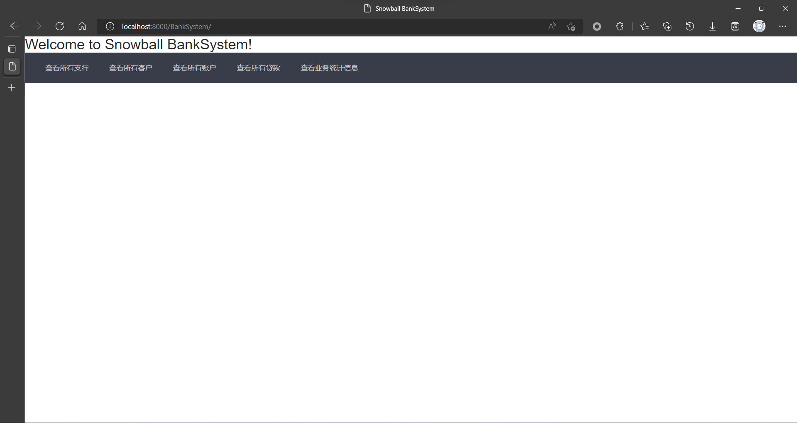

#### 支行列表

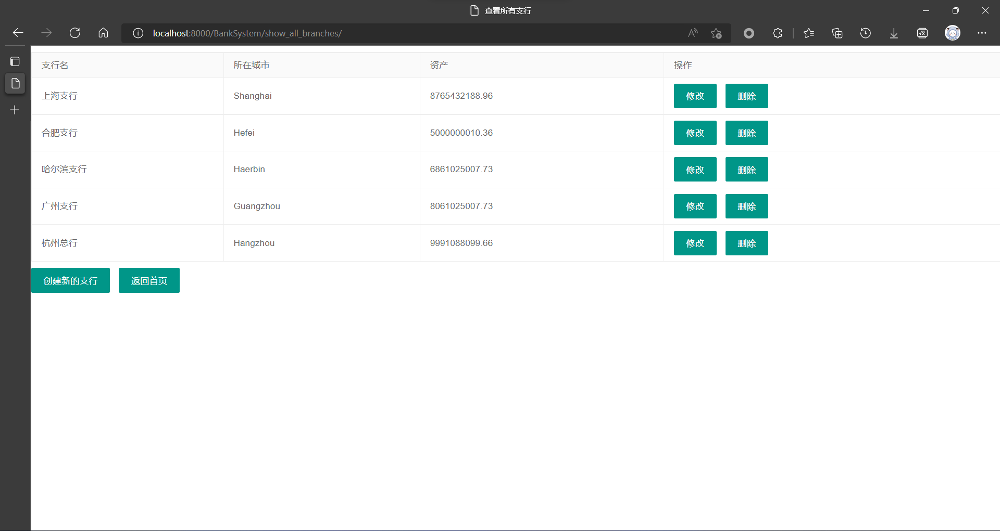

#### 客户列表

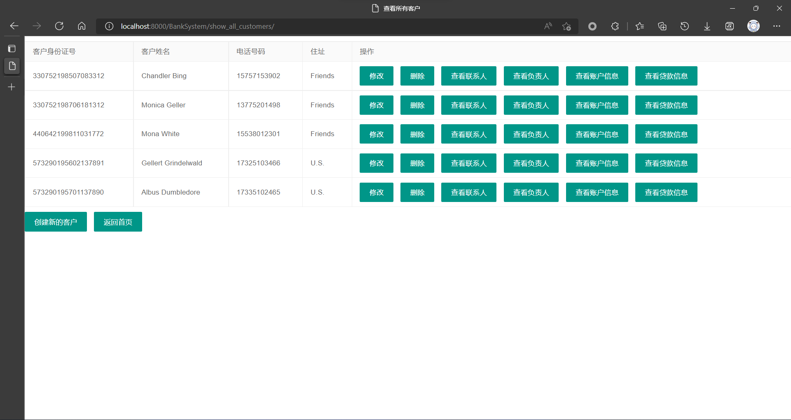

#### 创建客户

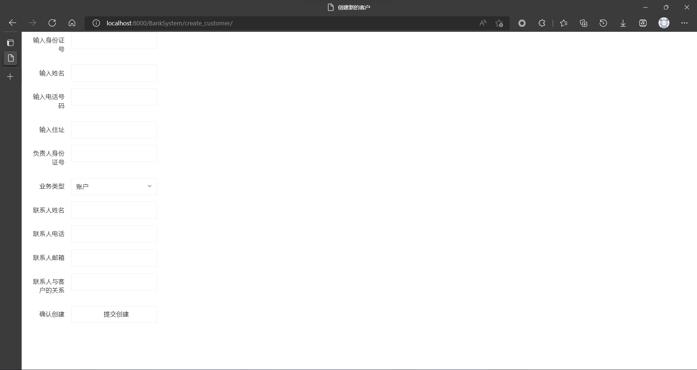

#### 查看客户所关联的账号

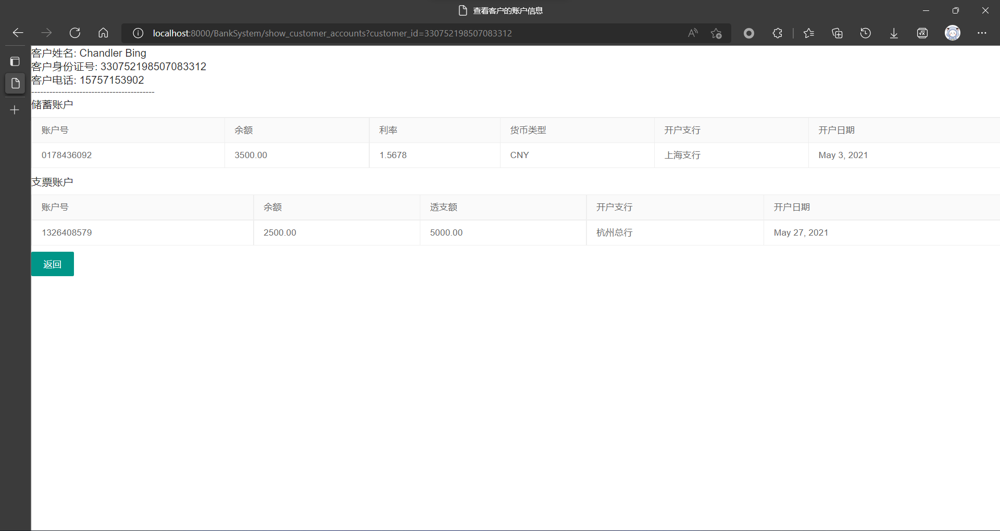

#### 账户列表

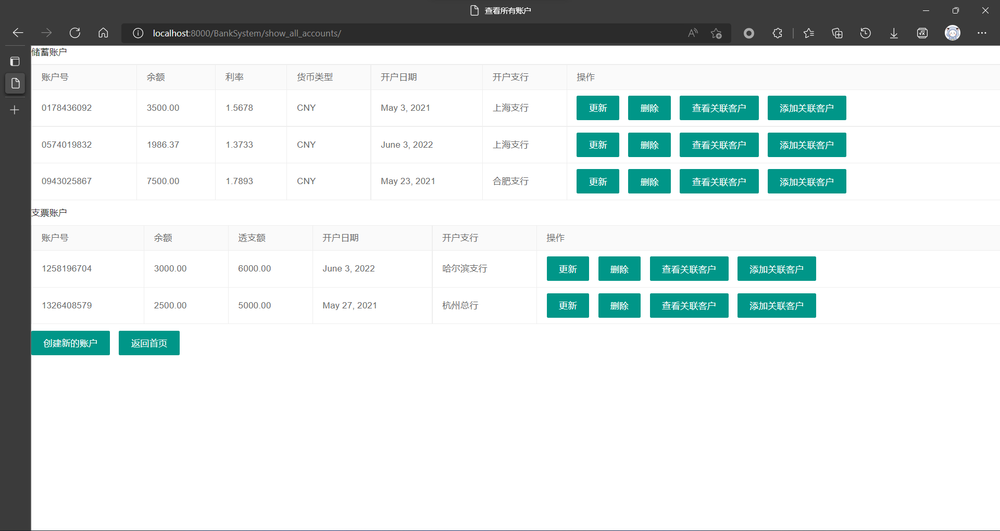

#### 创建账户

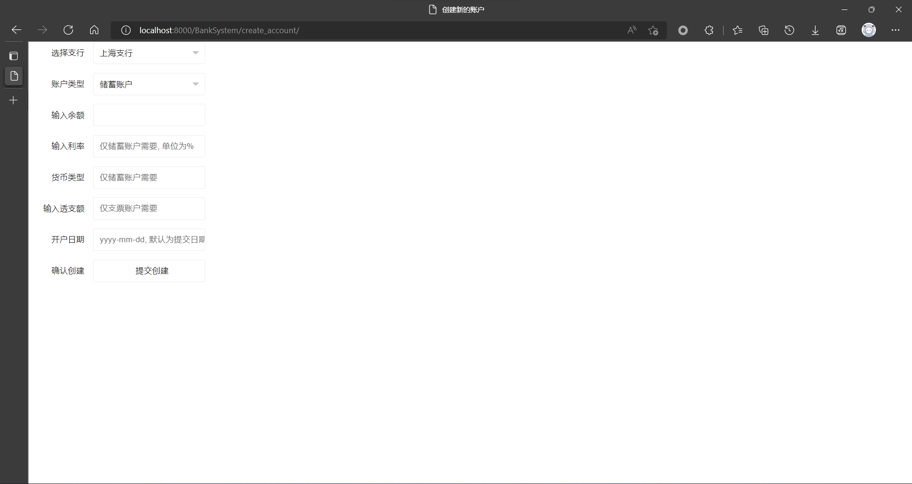

#### 查看账户所关联的客户

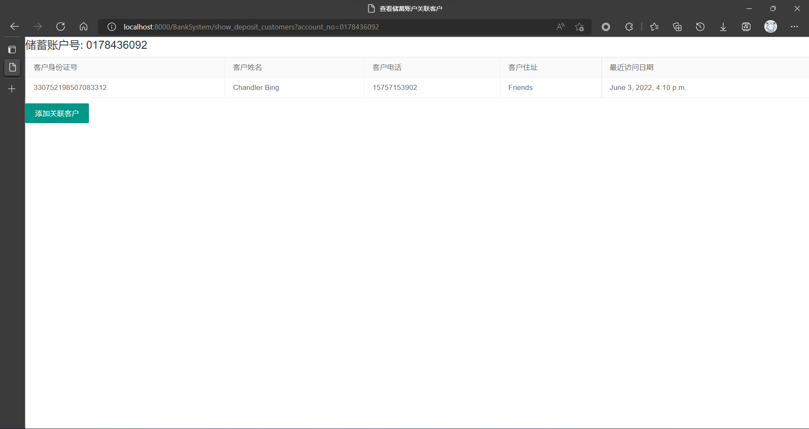

#### 贷款列表


#### 查看一笔贷款的发放记录

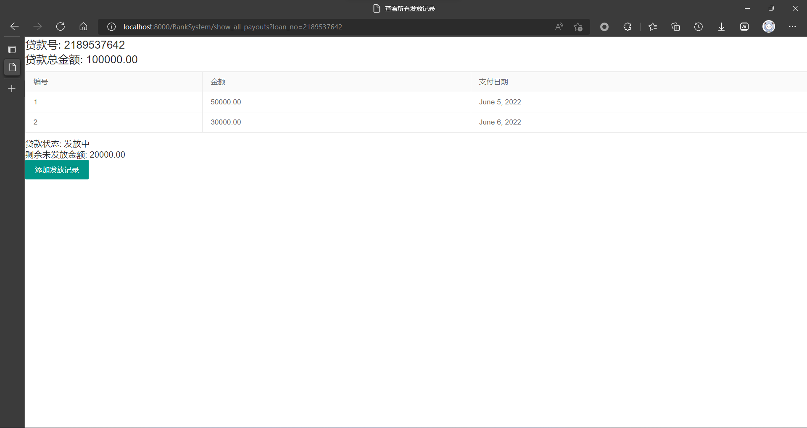

#### 查看储蓄业务按年份统计

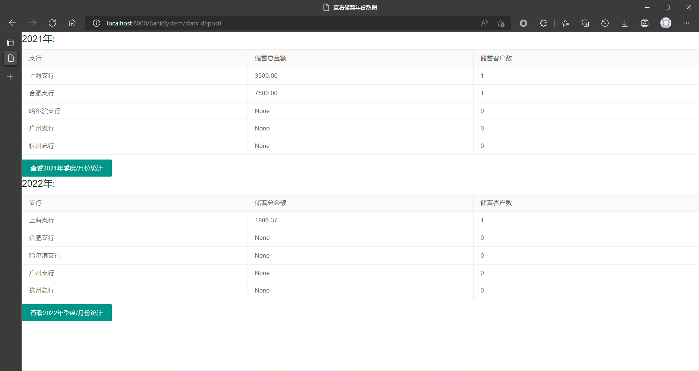

#### 查看贷款业务2022年的季度和月份统计

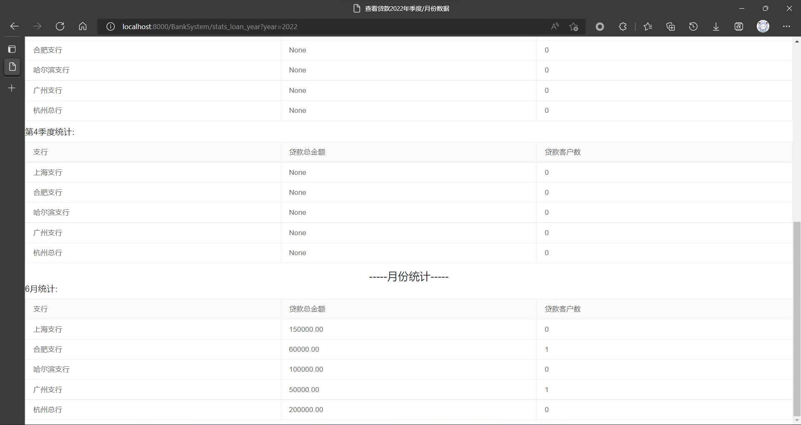

### 4.2 测试结果

以下展示部分操作的测试结果. 由于贴一个测试就要贴操作前、中、后的截图, 这样非常冗余, 就不一一贴图了.

#### 账户新增关联客户

初始时只有一位管理客户

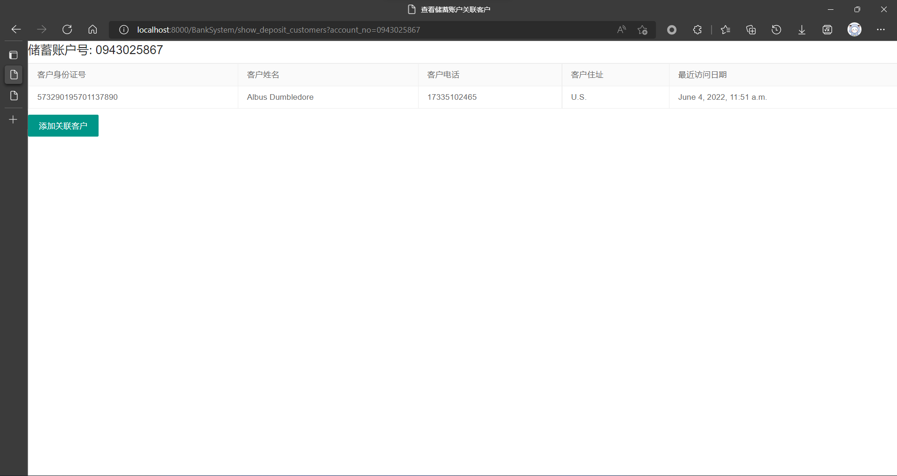

输入新增关联客户的身份证号

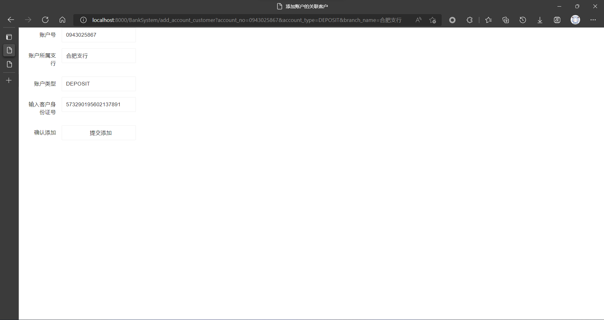

如果该客户存在, 则会添加成功, 再次查看

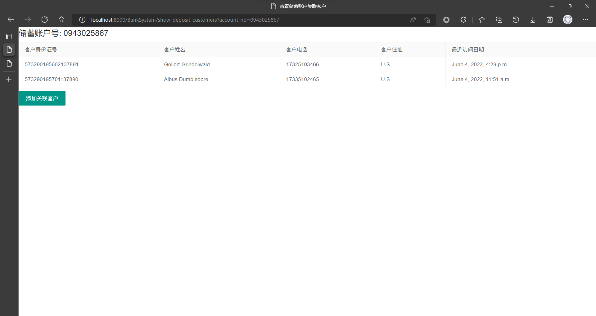

#### 删除一笔发放中的贷款

尝试删除发放中的哈尔滨支行的一笔贷款

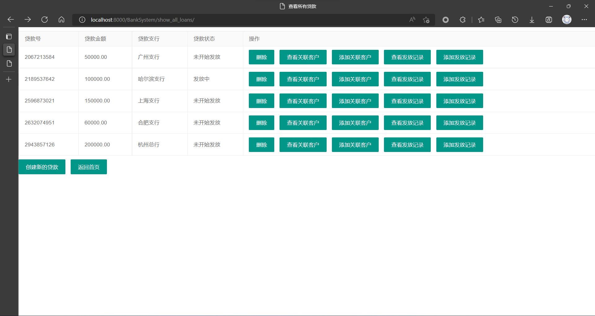

返回一个错误信息:

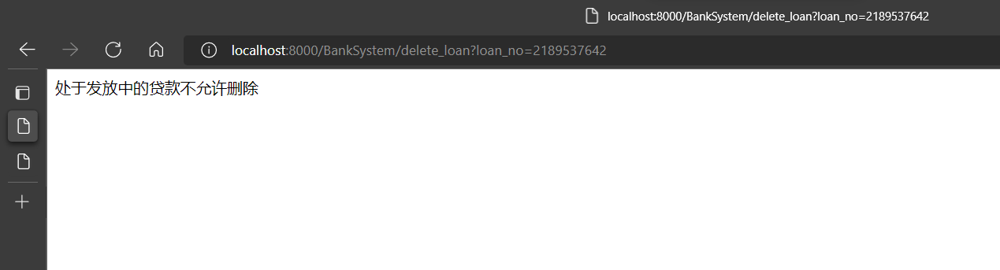

### 4.3 实现中的难点问题及解决

前面的各部分都或多或少提到过, 这里不再赘述.

## 5. 总结与讨论

本人一直想要有个机会较完整地学习和实践Web应用前后端开发的全过程, 在学期初初次接触 Django 框架, 但一直停留在理论学习阶段, 本次实验是一个绝佳的实践机会. 由于对 Django 很多细节都不是很了解, 在很多地方都花了较多时间调研和学习, 例如如何将本实验的系统结构与 Django 框架的各个部分对应起来, 一对一、多对一、多对多的外键关联在 Django 中是如何实现的, 根据 Django 的特点还对 Lab2 中设计的数据库模式进行了微调, 各个模板如何编写, 各个视图函数的实现细节, 以及如何使用css让自己的html更好看等等.

整体体验看来, Django的功能非常强大, 其支持语言为Python, 对新手上手比较友好, 尤其是其 ORM 的使用体验极佳, Django 的 ORM 封装了 SQL 语句操作, 让开发者可以更自然、更直观地对数据库进行操作, 而不必开发者自己亲自使用复杂的SQL语句维护数据库. 例如, 对于账户和客户之间的多对多关系, 使用==ManyToManyField==即可实现他们之间的关联, 而且支持双向查询, 而如果是自己用 SQL 实现, 就要自己亲自维护一张账户-客户关系表, 每次查询都要经过该表. 虽然底层实现也是通过这样一张表, 但这张表对开发者不可见, 开发者无需关心他们之间的映射是如何实现的. 还有删除时的外键约束, Django提供的==CASCADE==删除方式非常直观和合乎逻辑.

对于实验设计中个人觉得不足的部分, 这里引用[iBug先生的原话](https://ibug.io/cn/2020/06/db-lab-3-report/#312-部门):

>"作为对比，本实验的实验报告模板**极为冗长**，不仅要求重复实验文档中已有的内容，如系统目标和需求说明等，还要求绘制一大堆麻烦又没有意义的结构图流程图，并且说明一些毫无意义的细节（如各模块的输入、输出和程序流程图等）。此报告将本实验的整体体验结构拉到了一个十分科学的平衡点，即著名的[八二法则](https://zh.wikipedia.org/wiki/帕累托法则)：实验中 80% 的汗水带来了 20% 的痛苦（编写应用程序本身），而 20% 的汗水带来了 80% 的痛苦🤮（撰写实验报告）。本报告之所以能够写得如此详细尽致，不仅在于找准了写报告之道，关键在于找准了写报告之道。
>
>因此，本实验最亟需改进的地方，甚至可能是唯一需要改进的地方，就是**将这份又臭又长的实验报告模板扔掉**，为做实验的学生们，也为读实验报告的助教们减轻大量不必要的负担。
>
>本报告至此基本结束了，已近一万七千字，在此诚挚地向完整仔细阅毕本报告的各位助教们道一句：**辛苦了**，并恳请助教仔细考虑复杂繁长的实验报告的必要性，**谢谢助教**。"

此外, 我个人觉得本实验设计的另一大不足是重点偏离: 实验中与数据库直接相关的基本只有Model层建模型类以及View层中调用的ORM操作, 而且ORM接口甚至封装了 SQL 语句, 开发者甚至不需要理解底层的一些细节, 这可能对于这门课的学习来说不是那么好的一个方面. 而本实验中这两部分与数据库直接相关的代码量之和甚至可能还少于模板的代码量之和, 实验中很多精力都花在了前后端的交互处理上, 感觉重点偏离了.
